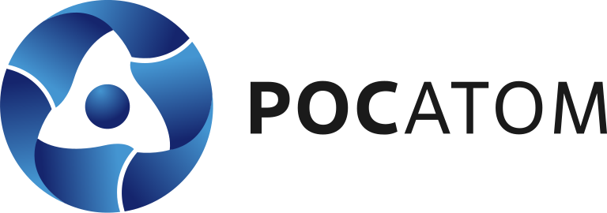
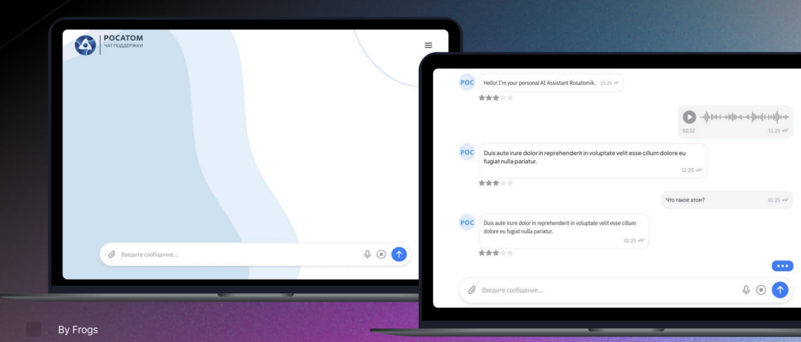
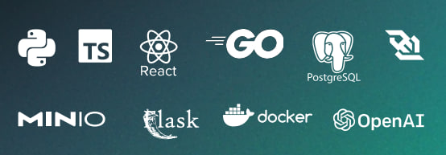

<div align="center">

# ХАКАТОН ОТКРОЙ#МОСПРОМ <br> Прототип агентной системы для обработки обращений в техподдержку



</div>

## Оглавление
- ### [Задание](#1)
- ### [Запуск кода](#2)
- ### [Уникальность нашего решения](#3)
- ### [Стек](#4)
- ### [Команда](#5)
- ### [Ссылки](#6)

## <a name="1"> Задание </a>

В Росатоме ежедневно обрабатывают десятки тысяч заявок по доступу и техническим сбоям.

Сейчас операторы вручную классифицируют и решают их, что замедляет процесс и перегружает сотрудников.

Участникам предлагается разработать прототип программно-аппаратного модуля в виде веб-сервиса с интеллектуальной системой для автоматизации обработки обращений пользователей внутри корпорации.

## <a name="2">Запуск кода </a>

### Последовательные шаги для запска кода:

1. Склонировать гит репозиторий;

```Bash
git clone https://github.com/Fact0RR/MOSPROM_FROGS.git
```

2. Добавить .env c чувствительной информацией в корень проекта:

```.env
HF_API_TOKEN=****Замените_на_ваш_Hugging_face_токен**********
HF_CHAT_MODEL=Qwen/Qwen3-8B:nscale
HF_CHAT_TEMPERATURE=0.7
# Leave HF_CHAT_MAX_OUTPUT_TOKENS empty to allow full responses by default.
HF_CHAT_MAX_OUTPUT_TOKENS=
HF_EMBEDDING_MODEL=intfloat/multilingual-e5-small
HF_RERANK_MODEL=sentence-transformers/paraphrase-multilingual-MiniLM-L12-v2
HF_TIMEOUT=60
HF_MAX_RETRIES=3
```
3. Запустить сборку контейнеров:

```Bash
cd https://github.com/Fact0RR/MOSPROM_FROGS.git
docker-compose up
```

4. После запуска всех контейнеров(контейнер с миграциями после отработки выключится) нужно подождать 2-3 минуты, чтобы скачалась и отработала embedding модель при инициализации (это связано с тем, что создание образа с cuda занимает от 10ти минут, что не подходило под условия защиты).
А дальше перейти по адресу ``localhost:5175``

<div align="center">



Веб-интерфейс

</div>

## <a name="3">Уникальность нашего решения </a>

1. Регистрация и авторизация
2. Быстрая скорость работы за счет выбора подходящей модели
3. Чат-бот с поддержкой голосового интерфейса.
4. Статистка запросов.
5. Возможность подключение в чат живого сотрудника
6. Агентная архитектура ReAct с различными вариантами разрешения проблемы (перевод на оператора, задавание дополнительных вопросов, ответ пользователю)
7. Мощный RAG инструмент: метод организации векторной базы данных RAPTOR, улучшение метрик при помощи Rerank и RagFusion

## <a name="4">Стек </a>





</div>

## <a name="5">Команда </a>

*Состав команды **"Жабки"***

- <h4>: @FRIZFOREVER, Хромов Кирилл - ML-engineer</h3>
- <h4>: @Timofey382, Пренко Тимофей - ML-engineer</h3>
- <h4>: @imyourrbestfriend,  Меликов Владислав - Frontend developer</h3>
- <h4>: @Llaceyne, Гулария Лана - Designer, Pitcher</h3>
- <h4>: @facT0RR, Маслов Денис - TeamLead/Backend developer</h3>

## <a name="6">Ссылки </a>

- [ссылка на скринкаст](https://drive.google.com/drive/folders/1AV1OihR0tMgg06eclJ7MylKVASHN3H-E)&nbsp;
